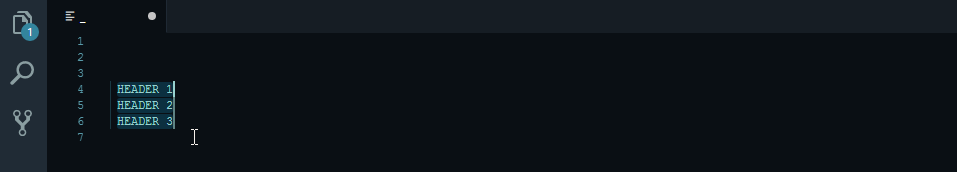

# Exchange selection start and end, Extend selection, Toggle selection mode commands for [Visual Studio Code](http://code.visualstudio.com)

# Features

- Adds a command to exchange selection start and end, similar to Emacs's `exchange-point-and-mark` command.
- Adds a command to extends the selection with user input text. You can use prefix|suffix to add prefix and suffix at the same time. When used with `Exchange Selection start and end`, you can add text at either end of the selection without loosing the selection.
- Adds a command to toggle betwen single contiguous selection mode and column selection mode with multiple selections. Depending on the settings `"exchangeSelectionStartAndEnd.columnSelectionMode": "..."` (see below) in column selection mode it will add a selection to short, partial and full lines. A short line is one that is shorter than the left edge of the selection. A partial line is one which is longer than the left edge of the selection. A full line is one that is at least as long as the right edge of the selection. Optionally short or partial lines can be padded to make them full.

# Demo



# Usage

- Invoke the `Exchange selection start and end` command from the Command Palette (windows/linux: `CONTROL`-`SHIFT`-`P` or mac: `COMMAND`-`SHIFT`-`P`) or the default keybinding (windows/linux: `ALT`-`SHIFT`-`X` or mac: `OPTION`-`SHIFT`-`X`).
- Invoke the `Extend selection with text ( [prefix][|[suffix]] )` command from the Command Palette or the default keybinding (windows/linux: `CTRL`-`ALT`-`SHIFT`-`X` or mac: `COMMAND`-`OPTION`-`SHIFT`-`X`).
- With a multi-line selection, invoke the `Toggle selection mode` command from the Command Palette or the default keybinding (windows/linux: `ALT`-`SHIFT`-`S` or mac: `OPTION`-`SHIFT`-`S`).

## Settings (Configuration)

You can configure how the line length affects the selection in that line and wheather the line is padded by setting the following e.g.

```
"exchangeSelectionStartAndEnd.columnSelectionMode": "short"
```

Possible values are:

```
"short"       - This is the default. Every line - short, partial or full will always have a selection.
"short+pad"   - Short lines will be padded to make them full and will have a selection cursor.
"partial"     - A line will have a selection cursor if it is longer enough to be in the range of selection, albeit partially.
"partial+pad" - A line will have a selection cursor if it is longer enough to be in the range of selection, albeit partially. The line will be padded to make it full.
"full"        - A line will always have a selection cursor only if it is long enough to be fully in selection range.
```